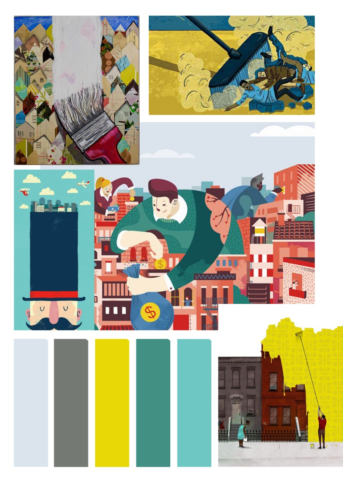
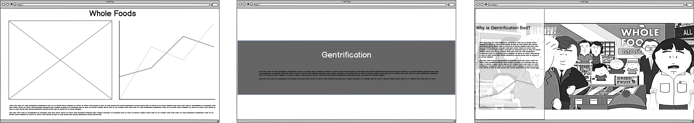
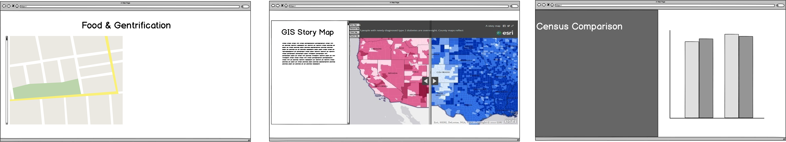
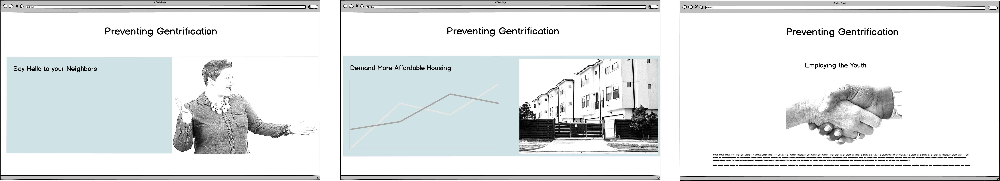
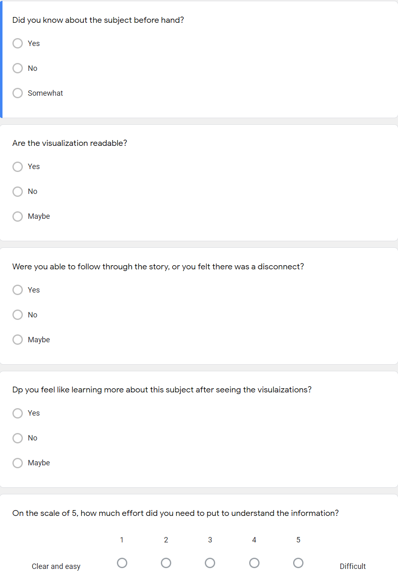

# Final Project - **Food & Gentrification**
## Part II

> To further develop the project, I started by creating a mood board and to formulate a template and color scheme on how to move further with the story.

## Mood Board

> The images selected were artistic impressions on Gentrification to derive how other people conceive gentrification and the color scheme that can be used to cohesively describe a story.

## Story Board

On the basis of the previously created wireframes on Balsamiq, I developed them further through Infogram to incorporate data sets created in tableau and to visualize the story as a whole before getting the user feedback.

> Section 1 depicts the three questions of what is whole foods? What is gentrification? And Why is gentrification bad?

Section 2 is when I will start to correlate Whole Foods and Gentrification through the example of East Liberty, Pittsburgh. 

Section 3 and the resolution will focus on identifying a solution, not at the expense of development.

<a href="https://infogram.com/9f3badd1-62fd-4afb-83fa-d2587ac94ae5" style="color:#989898!important;text-decoration:none!important;" target="_blank">Untitled chart</a> <a href="https://infogram.com" style="color:#989898!important;text-decoration:none!important;" target="_blank" rel="nofollow">Infogram</a>

Continued below

<a href="https://infogram.com/13c46e15-8ac6-4677-b5d7-cb44040cc6dc" style="color:#989898!important;text-decoration:none!important;" target="_blank">Untitled dashboard</a> <a href="https://infogram.com" style="color:#989898!important;text-decoration:none!important;" target="_blank" rel="nofollow">Infogram</a>

## User feedback

> For the User Feedback, I decided to get feedback from 4 persons 

> 1. USER A - A professor who has plenty of knowledge about Gentrification and can provide criticism on the overall idea and notions.
> 2. USER 1-3 - Three students who may or may not have heard about gentrification.

> USER A
> Female Professor, School of Architecture
> After introducing to her about the course and the topic I walked her through my work done so far to get her inputs. It was not according to the Q&A I had prepared and was mostly her eperiince and criticism on the overall idea. The 3 major takeaways were – 
>> 1.	She appreciated the topic and shared the basic timeline of how things happened in East Liberty, Pittsburgh. Whole foods strategic location in proximity to Shadyside, an affluent neighborhood played a major role.
>> 2.	She said that though Whole Foods acted as an anchor tenant in generating real estate activities around the area, other development projects also played the role. The crime rate has significantly decreased in the area but on the expense of its citizens and could have been avoided.
>> 3.	She also shared the fact that whole foods and other development projects did employ the local youth but did not train them and eventually were let go from their jobs. 

> The next 3 user feedback were with CMU students with different profiles – 
> User 1 – Female, Design
> User 2 – Male, Tepper
> User 3 – Female, School of Architecture

> Firstly, I shared a link with them about the project and gave them a google survey form to fill the feedback. Then I discussed with them further to get a constructive feedback.

> The questions that followed up after the survey were – 
>> •	Can you tell me what you think this is?
>> •	Three words to describe the story.
>> •	Can you describe to me what this is telling you?
>> •	Is there anything you find surprising or confusing?
>> •	Who do you think is the intended audience for this?
>> •	What stood out to you? What did you find worked well? What didn't?
>> •	Is there anything you would change or do differently?
>> •	Was there any visualization that you felt could have been better or was not required?

> The main takeaways from each user’s feedback were – 

> User 1 –
>> Three Words – Gentrification, Story, informative
>> 1.	She had no idea about gentrification beforehand but was able to corelate with the information easily. 
>> 2.	She felt that the story board was put nicely together.
>> 3.	She felt the two infogram boards could have a better co relation and suggested a additional visualization for whole foods and gentrification.
>> 4.	She felt that the graphic used for gentrification of cities (bar graph) was not clear.

> User 2 – 
>> Three Words – Analysis, Gentrification, Compelling
>> 1.	His main takeaway from the project was - “A project trying to corelate Whole foods and gentrification, why gentrification is bad and explore possible solutions”.
>> 2.	Some of the visuals like the graph on ‘why gentrification is bad’ was confusing and did not articulate the purpose.
>> 3.	The story board is well put together and easy to understand. Some of the visuals are also very interesting.

> User  – 3
>> Three Words – Food, Development, People
>> 1.	She knew about the subject well enough and was able to easily follow through the entire story and felt it was well connected.
>> 2.	Labelling is not legible; the legend needs to be more descriptive for the graphs.
>> 3.	She suggested that she would reverse the order and explain Gentrification first, why is Gentrification Bad and then what is whole foods. She said, “Your main topic is Gentrification and how Whole foods has caused Gentrification, So maybe as the main Topic again I'll put Gentrification and Food”.
>> 4.	She like the brown and Grey Color scheme, and how it suddenly becomes bright when you are giving solution

## Revised Story Line

> On the basis of the user surveys, I decided to shift the medium of work to shorthand and start creating a framework to improve and create a storyline. 

<h1>Gentrification and Food</h1>
 When Whole Foods or Starbucks enter into a neighborhood the first thought that comes in your mind is “that’s awesome” But is it really? 

> [Story Preview](https://carnegiemellon.shorthandstories.com/gentrification-and-food/index.html)

