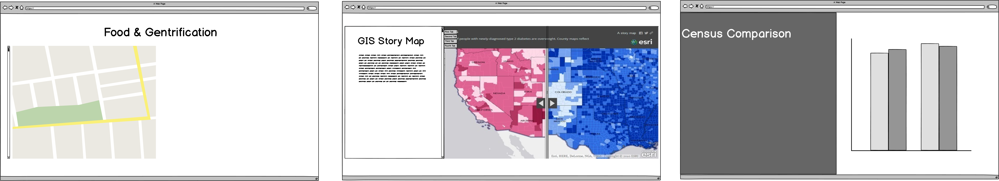

# Final Project - **Food & Gentrification**
## Part III - Walkthrough of the Process

> Cities as they grow and develop, the neighborhoods which are often ignored get a chance for revival. But is important to understand that development should not come at a cost of the citizens originally from that neighborhood. There has been a lot of reasons associated with Gentrification and the effect of high-end development has been one of them. Through this project, I am using Whole Foods as an example to highlight how the neighborhood which is already in the process of gentrifying accelerates the whole process. 

### The Idea - [Part 1](FinalProject_Jayesh.md)

> The idea of the project food and gentrification is to highlight how things like grocery stores can spark gentrification in a neighborhood. Whole foods have always been at the center of the debate of who came first gentrification or whole foods. Their strategic location such as east liberty in Pittsburgh or Englewood in Chicago gives them a tactical advantage of being surrounded by affluent neighborhoods but their placement in a neighborhood such as east liberty which is already struggling with gentrification puts them at the center of accelerating the gentrification of a neighborhood. These premium food chains can create socio-economic inequality resulting in driving the original population of the neighborhood of their households.
The difficult part is how can we prevent gentrification? The 4-step approach or the plan of action would be –
1.	Know Your neighbors
2.	Demand more affordable housing
3.	Ask for Tax Freeze
4.	Training and Employment for the local youth in these chains to encourage community development

> Part 1 helped in analyzing how the project can be structured and how the storyline should evolve. With keeping that in mind I decided to create a line graph based on the scale of user interest to devise the story arc. It helped in visualizing as to how I can keep track of what I was doing and what other sources or data I need to look for. 

<noscript></noscript><object class='tableauViz'  style='display:none;'><param name='host_url' value='https%3A%2F%2Fpublic.tableau.com%2F' /> <param name='embed_code_version' value='3' /> <param name='path' value='shared&#47;9TK3QSF3Q' /> <param name='toolbar' value='yes' /><param name='static_image' value='https:&#47;&#47;public.tableau.com&#47;static&#47;images&#47;9T&#47;9TK3QSF3Q&#47;1.png' /> <param name='animate_transition' value='yes' /><param name='display_static_image' value='yes' /><param name='display_spinner' value='yes' /><param name='display_overlay' value='yes' /><param name='display_count' value='yes' /><param name='filter' value='publish=yes' /></object>
                

> Eventually, I started to realize that the story arc needs to be modified as the topic in itself was complicated and could not be justified with what I had originally thought. The What, When and How needed to include the effects these things on Neighborhood, positive as well as Negative. 

> As a storyteller, I shouldn’t enforce my views on the reader and rather provide them with both sides of the coin. The end result should be a call of action that targets the negative impact and protects the neighborhood while it revitalizes.

#### Wireframes

To create the first set of wireframes, I used Balsamiq to visualize how the story map will respond to the story arc. Balsamiq makes it very simple to sketch out the screens of how you think your project should be framed and gives a rough idea of your methodology of working. 

> Section 1 depicts the three questions of what is whole foods? What is gentrification? And Why is gentrification bad?

Section 2 is when I will start to correlate Whole Foods and Gentrification through the example of East Liberty, Pittsburgh. 

Section 3 and the resolution will focus on identifying a solution, not at the expense of development.

### Design and User Research [Part 2](FinalProject_2.md)

#### Story Board

>  the basis of the previously created wireframes on Balsamiq, I developed them further through Infogram to incorporate data sets created in tableau and to visualize the story as a whole before getting the user feedback.

<a href="https://infogram.com/9f3badd1-62fd-4afb-83fa-d2587ac94ae5" style="color:#989898!important;text-decoration:none!important;" target="_blank">Untitled chart</a> <a href="https://infogram.com" style="color:#989898!important;text-decoration:none!important;" target="_blank" rel="nofollow">Infogram</a>

Continued below

<a href="https://infogram.com/13c46e15-8ac6-4677-b5d7-cb44040cc6dc" style="color:#989898!important;text-decoration:none!important;" target="_blank">Untitled dashboard</a> <a href="https://infogram.com" style="color:#989898!important;text-decoration:none!important;" target="_blank" rel="nofollow">Infogram</a>

#### User Review

> After creating a detailed storyboard, it was important to get user feedback and critique to understand if your story works, things you may have missed out as the fatigue hits working on the same thing. or the User Feedback, I decided to get feedback from 4 persons 

> 1. USER A - A professor who has plenty of knowledge about Gentrification and can provide criticism on the overall idea and notions.
> 2. USER 1-3 - Three students who may or may not have heard about gentrification.

> The user reviews were very helpful especially the one with the professor in the School of Architecture. She helped me in understanding the issue of gentrification and the underlying causes. The student reviews helped in realizing that there might some breaks in my storyline and how a few graphics were difficult to read. While I was designing the visualizations, since I had already seen the database, it felt to me that I could read the graphics without considering the intended audience. There was some positive feedback also on how the overall the storyline meant sense to them, the change in color scheme with each section was exciting and that they would love to see the final version.

