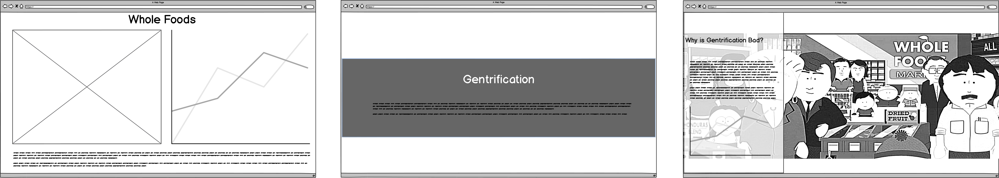

# Final Project - **Food & Gentrification**

## Project Outline - 

<noscript></noscript><object class='tableauViz'  style='display:none;'><param name='host_url' value='https%3A%2F%2Fpublic.tableau.com%2F' /> <param name='embed_code_version' value='3' /> <param name='path' value='shared&#47;9TK3QSF3Q' /> <param name='toolbar' value='yes' /><param name='static_image' value='https:&#47;&#47;public.tableau.com&#47;static&#47;images&#47;9T&#47;9TK3QSF3Q&#47;1.png' /> <param name='animate_transition' value='yes' /><param name='display_static_image' value='yes' /><param name='display_spinner' value='yes' /><param name='display_overlay' value='yes' /><param name='display_count' value='yes' /><param name='filter' value='publish=yes' /></object>
                

#  
> When Whole Foods or Starbucks enter into a neighborhood the first thought that comes in your mind is “that’s awesome” But is it Really?

> The idea of the project food and gentrification is to highlight how things like grocery stores can spark gentrification in a neighborhood. Whole foods have always been at the center of the debate of who came first gentrification or whole foods. Their strategic location such as east liberty in Pittsburgh or Englewood in Chicago gives them a strategic advantage of being surrounded by affluent neighborhoods but their placement in a neighborhood such as east liberty which is already struggling with gentrification outs them at the center of igniting the gentrification of a neighborhood. These premium food chains can create socio-economic inequality resulting in driving the original population of the neighborhood of their households.

> The difficult part is how can we prevent gentrification? The three-step approach or the plan of action would be – 

1.	Know Your neighbors 
2.	Demand more affordable housing 
3.	Employment for the local youth in these chains to encourage community development

> For the final project, I would be focusing on east Liberty in Pittsburgh and understanding the impact Whole Foods has had on the neighborhood.

## Initial Sketches

### What?

> Section 1 depicts the three questions of what is whole foods? What is gentrification? And Why is gentrification bad? The graphs would be based upon the statistics of how while foods have grown in the united states and their presence. A map of the United States with the presence of whole foods in a choropleth map in tableau. Followed by the definition of Gentrification and Why gentrification is bad.

> The main idea is for the viewers to visualize and grasp the context before indulging in the main story of food and gentrification. For the 1st part, I would like to keep the visualizations simple so as the user can correlate without requiring the interpretation of graphics.

### When?

> Section 2 is when I will start to correlate Whole Foods and Gentrification through the example of East Liberty, Pittsburgh. This the middle of the conflict part of the story. I will start showing the users how the demographics of the neighborhood have changed over the years and when did whole foods come into the picture. Though there are a few limitations in this – 

•	The yearly demographic data available block-wise is limited and they area understudy was on the verge of gentrification and whole foods just ignited the whole process. 
•	There might be other factors involved in gentrification but nevertheless, the idea of this project for me is to create a base in which 

> I can continue further after the course to study similar effects in Chicago, Detroit, Boston, etc. 
The comparison of the data of the census tracts from the year 2000 and the year 2010 will help the user understand the change in demographics and the households this neighborhood has seen.

### How?

> Section 3 and the resolution will focus on identifying a solution, not at the expense of development. Stores like whole foods though may have caused gentrification but were also involved in the development of Neighborhood and so the plan of action should not be focused on the expense of the neighborhood. The three-step action plan that I would like to suggest is –

1.	Know your Neighbor – The idea is that if you are one of the residents moving in a gentrifying neighborhood, do not ignore the current residents. Don’t make them feel the socio-economic differences and engage with them in a conversation to understand the dynamics of an old neighborhood.
2.	Demand more affordable housing – Asking the city to invest and encourage the developers to provide more affordable housing so that the ethnicity of the neighborhood can be maintained.
3.	Employment for the local youth in these chains to encourage community development and introducing employment and skill-based opportunities of r the people in the neighborhood to make them capable enough to live happily in their own neighborhoods.

## Data Sources

> Data on Whole Foods statistics

>> The statistics on Whole Foods will help in analyzing how Whole Foods has grown over the time in United states and their presence state wise so a user can visualize along with the narrative on what exactly is whole foods.

> Data on Demographic Change in Pittsburgh

>> Datausa.io provides the demographic profiles of people living in Pittsburgh and how it is changing over the last 5 years, I would be using the data from here to create graphics on how median household income and rents have increased in the last few years and their correlation.

> Data sources to Study Neigborhood Level Gentrification

>> The census tracts and the GIS data will help me create story maps on ESRI Arc Gis and through which I plan to create Swipe maps to show a comaprison between year 2000 and year 2010 at tract level and block level (if the data is available for block level). 

> Neighborhood Profile - East Liberty

>> 
