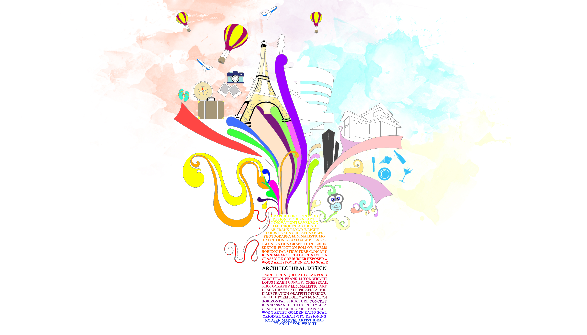

 

## About me
> I am a first-year student pursuing master of science in architecture engineering construction management at Carnegie Mellon University. I completed my under graduation in architecture from India in 2015 and have been working since then as an architect and photographer. Over the last 4 years, I have worked on various projects ranging from conservation management to large scale housings and commercial complexes.
> Over at CMU, my course work currently focuses on learning real estate design and development in the United States along with the basic understanding of finance.

## What I hope to learn
> Less is More
The thing that I would really like to learn is minimizing visualizations up to an extent where a layman can understand the most important aspect of the data. Colors psychology and synchronization is another aspect which I hope to learn from this class.

## Portfolio
> https://bit.ly/2mgToSO
