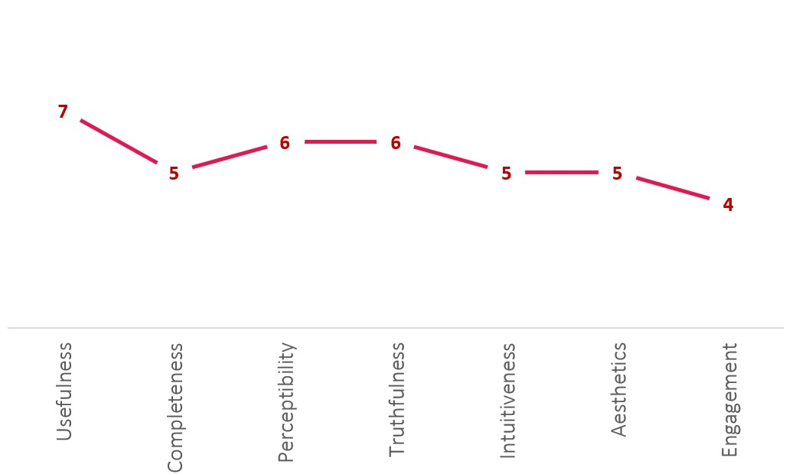

# Critique by Design

## Unprecedented shifts in population drive changes in demand for real estate

### Orignal Report Page

> Source - https://www.pwc.com/gx/en/asset-management/publications/pdfs/real-estate-2020-pwc.pdf 

Real Estate 2020 is a 40-page report created by PWC real estate division. It is intended for anyone interested in real estate trends across the globe. I came across this pdf while I was reading megatrends in real estate. Page number 13 has 3 graphs that talk about looking at the projections in population shifts happening around the world and is it significant enough to impact demand in real estate. For this assignment I have focused on figures 6 & 7 as the visualization in figure 6 is still understandable but it becomes confusing due to the use of a very similar color set and I was not able to differentiate between Mexico, USA and World. Figure 7 on the other hand I feel is manipulating information to put the focus on the fact that the population above 60 years is increasing, though it conveys the information to the audience but is not truthful to the actual interpretation of the data.

### Critique

> The visualization is representing data which is important for the report in terms of analyzing how the trend in demands in real estate will change with changing demographics. The part which stood out to me is the use of consistent colors that represents the PWC colors used throughout the report. Figure 6 is confusing as the graph is representing 10 data sets with few of them having overlapping information. The first thing I would have done on an initial look is grouping the countries continent wise and representing them as per that color set. Figure 7 shows the proportion of the world population above 60 years of age, but representation is in a way that creates the impression that the proportion is much higher than the actual. I think it is done to reinforce the point of changing demographics and its impact on real estate. I would have firstly avoided the 3d graph and created a visualization that shows the proportion from 100% rather than the current 25% of the Y-axis.

### Wireframes
> Firstly, I started working on figure 6 and identifying main problems with the graph. I found the data used in the graph through Eurostat and the United Nation’s world population prospects -2010. I broke the data to extract the required elements and imported and further refined it through Tableau. I used dual-axis representation to create lines and marking the 10-year milestones with circles. I grouped the countries as per the continents to create a refined color scheme. 
> For figure 7 the main problems were 3-dimensional representation and inaccurate description, but I liked the pictograph which they had created for representing the proportion of the world population above 60 years of age. I used Visme.co to create a pictograph representation of the same and tried using the colors as per the PWC color scheme as the page was part of a report.

> I worked on Infogram to create wireframes for the visualization. I worked on creating multiple wireframes but mainly focused on two. The first wireframe was based on the report page and I just tried to rework with the color scheme on the page to include the colors of PWC without reinforcing them on the graphs. For the second wireframe, I decided to provide a high percentage of paper space to figure 6 as it had multiple lines overlapping each other. And recomposed the page in a horizontal manner. 

> User Feedback
> I shared the wireframes with 2 users for their feedback. I did have to tell them the basic background of the report to have a better understanding. User 1 understood the gist of the information in figure 6 and was amazed by the numbers, specifically Japan. She felt that the information provided in figure 7 was confusing and at first, thought that the percentages represented some trends. She could correlate with the information and felt that the target audience would be anyone working or having an interest in real estate. She preferred the first wireframe as she thought the 2 images have a story to tell together so it is easy to interpret the story. User 2 had similar feedback but felt that the graph in figure 6 had too much information juxtaposed that it was difficult for him to pick out an individual country’s data.

### Data Visualization
After the user feedback, I analyzed both the graphs again and found a mistake in figure 7, as I forgot to mention the years below the pictograph and was the cause of confusion. I also relooked at the figure 6 graph and realized that for a better understanding of real estate markets, it would be ideal to divide the countries on the basis of their economy and use multiple graphs side by side to make things clearer. I recomposed the wireframe to include the revised visualization and shared them again with one of the users who felt that the information was much more legible and advised if I can think about creating more space by removing figure 8.

> Figure 6 : Projected old-age dependency ratio

<noscript></noscript><object class='tableauViz'  style='display:none;'><param name='host_url' value='https%3A%2F%2Fpublic.tableau.com%2F' /> <param name='embed_code_version' value='3' /> <param name='site_root' value='' /><param name='name' value='Populationaged65years&#47;Population-EurostatandUNWorldPopulationProspects-2010' /><param name='tabs' value='no' /><param name='toolbar' value='yes' /><param name='static_image' value='https:&#47;&#47;public.tableau.com&#47;static&#47;images&#47;Po&#47;Populationaged65years&#47;Population-EurostatandUNWorldPopulationProspects-2010&#47;1.png' /> <param name='animate_transition' value='yes' /><param name='display_static_image' value='yes' /><param name='display_spinner' value='yes' /><param name='display_overlay' value='yes' /><param name='display_count' value='yes' /></object>

>> Source - Hage, K., Stoschek, U., So, K., Walters, P., Hughes, C., Jr, B. C., Beausoleil, L.-A., & Santos, J. (n.d.). Real Estate 2020—Building the future. 40.
Eurostat and UN World Population Prospects 2010 (revision)

> Figure 7 :  Proportion of the world population aged 60 years or more

Made with <a href="https://www.visme.co/presentation-software?utm_source=CTA&utm_medium=Embed" target="_blank" style="color: #314152; font-size: 12px; font-family: Montserrat,serif; font-weight: 600; text-decoration: none"> Visme Presentation Maker</a>

>> Source - Hage, K., Stoschek, U., So, K., Walters, P., Hughes, C., Jr, B. C., Beausoleil, L.-A., & Santos, J. (n.d.). Real Estate 2020—Building the future. 40.

## Final Wireframe

<a href="https://infogram.com/d79e279b-4a7c-478c-9519-61b5318a10fd" style="color:#989898!important;text-decoration:none!important;" target="_blank">PWC final</a> <a href="https://infogram.com" style="color:#989898!important;text-decoration:none!important;" target="_blank" rel="nofollow">Infogram</a>

